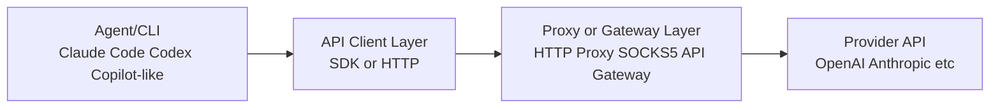
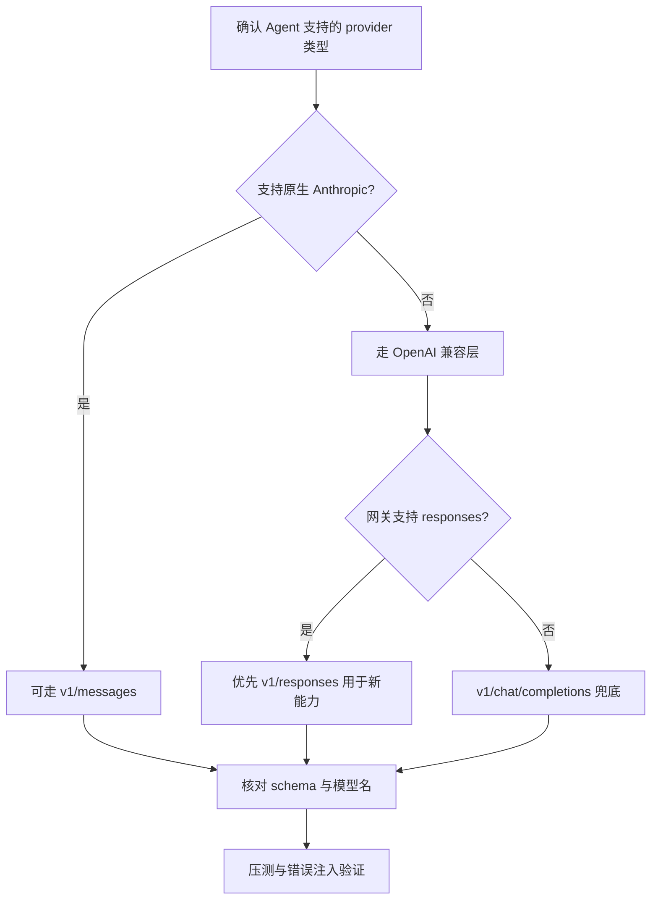

> [!summary]
>
> 本文把你提供的几篇博客内容做了统一整理，目标是解决四类问题：
>
> 1. Claude Code 与 Codex 在受限网络下如何稳定使用（代理/隧道/中转）
> 2. 如何正确接入第三方模型网关（Base URL、Key、模型名）
> 3. `/v1/chat/completions`、`/v1/responses`、`/v1/messages` 到底怎么选
> 4. 在通用 Agent（如可接多厂商模型的 IDE/CLI/平台）里，如何选择接口模式并避免常见坑

# 先记住三条总规则

- 规则 1：先看“客户端协议”，再看“模型名”  
  不是模型决定接口，而是客户端使用的协议决定接口。
- 规则 2：Base URL 和 Endpoint 分开理解  
  大多数配置项要求填 Base URL（通常到 `/v1` 或域名根），不是完整接口路径。
- 规则 3：排错顺序固定为  
  **网络连通性 -> 鉴权 -> Endpoint -> 请求体 Schema -> 模型名**。

# 术语与架构

## 三种常见接入形态

- 直连官方：直接访问 Anthropic/OpenAI 官方 API
- 第三方网关/中转：统一入口，后端转发到多个模型提供方
- 内网代理链路：本地 CLI -> 本地/远端代理 -> 外网 API

## 推荐的工程化分层



价值：

- 可观测：请求日志可统一收集
- 可切换：改网关或改模型不改业务流程
- 可控：网络出口、ACL、限流、审计可统一执行

# 网络代理配置

## 什么时候必须配代理

- 内网/校园网/企业网限制外网出口
- 地区网络策略导致 API 不可达或高延迟
- 需要抓包、审计、稳定出口 IP

## Claude Code 建议配置

在 `~/.claude/settings.json` 使用进程内环境变量注入（不污染全局 shell）：

```json
{
  "env": {
    "HTTP_PROXY": "http://127.0.0.1:1081",
    "HTTPS_PROXY": "http://127.0.0.1:1081",
    "ALL_PROXY": "socks5://127.0.0.1:1080"
  }
}
```

### Claude VS Code 扩展设置（避免强制登录弹窗）

在 VS Code 用户设置或工作区设置中添加：

```json
{
  "claudeCode.disableLoginPrompt": true
}
```

说明：该项用于关闭 Claude Code 扩展的登录提示弹窗，适合你已经通过 API 网关/环境变量完成鉴权，不希望每次被引导登录官网账号的场景。

### Claude settings.json（第三方网关 + 代理）参考

你给出的思路整体合理，但有 3 个细节建议修正：

- `ANTHROPIC_AUTH_TOKEN` 只有在你的网关明确要求该字段时使用；通用兼容场景更常见的是 `ANTHROPIC_API_KEY`
- `HTTPS_PROXY` 往往仍写 `http://proxy-host:port`（HTTP CONNECT 代理）；只有代理服务本身就是 HTTPS 入口时才写 `https://...`
- JSON 必须严格合法（引号闭合、逗号位置正确）

可直接使用下面这个稳妥模板：

```json
{
  "$schema": "https://json.schemastore.org/claude-code-settings.json",
  "env": {
    "ANTHROPIC_BASE_URL": "https://direct-api.example.com",
    "ANTHROPIC_API_KEY": "sk-xxx",
    "CLAUDE_CODE_DISABLE_NONESSENTIAL_TRAFFIC": "1",
    "CLAUDE_CODE_ATTRIBUTION_HEADER": "0",
    "HTTP_PROXY": "http://127.0.0.1:xxxx",
    "HTTPS_PROXY": "http://127.0.0.1:xxxx",
    "ALL_PROXY": "socks5://127.0.0.1:xxxx"
  }
}
```

如果你的服务商文档明确要求 `ANTHROPIC_AUTH_TOKEN`，可把上面的 `ANTHROPIC_API_KEY` 替换为 `ANTHROPIC_AUTH_TOKEN`，两者不要同时混用。

## Codex 建议配置

Codex 常见方式是写入 `~/.codex/.env`：

```env
https_proxy="http://127.0.0.1:1081"
http_proxy="http://127.0.0.1:1081"
all_proxy="socks5://127.0.0.1:1080"
```

### `.codex/auth.json`（免交互登录）

这个全局配置思路是正确的。对 Codex CLI（以及复用同一套 Codex 凭据的 VS Code 场景）来说，提供 API Key 后通常可以避免每次走网页登录流程。

```json
{
  "OPENAI_API_KEY": "sk-xxx"
}
```

建议：

- 文件路径：`~/.codex/auth.json`
- 避免提交到仓库（加入 `.gitignore`）
- 本机权限尽量收紧（仅当前用户可读）

注意：如果你的 `config.toml` 里使用了 `env_key = "OPENAI_API_KEY"`，仅写 `auth.json` 可能仍会报“找不到环境变量”。

- `env_key` 读取的是进程环境变量
- 需要额外在 `~/.codex/.env` 或系统环境变量中提供 `OPENAI_API_KEY`

可在 `~/.codex/.env` 增加：

```bash
OPENAI_API_KEY="sk-xxx"
```

### Codex 全局 `config.toml`（你给的版本校正）

你给的字段大体可用，但如果目标是“免登录 + 走 API Key”，建议不要使用 `requires_openai_auth = true`。

- `requires_openai_auth = true` 更偏向要求 OpenAI 账号认证链路
- 免登录场景建议改为 `env_key = "OPENAI_API_KEY"`（读取 `auth.json` 或环境变量中的同名 Key）

推荐写法如下：

```toml
model_provider = "OpenAI"
model = "gpt-5.6-terra"
review_model = "gpt-5.6-terra"
model_reasoning_effort = "high"
disable_response_storage = true
network_access = "enabled"
windows_wsl_setup_acknowledged = true

[model_providers.OpenAI]
name = "OpenAI"
base_url = "https://direct-api.example.com/v1"
wire_api = "responses"
env_key = "OPENAI_API_KEY"

[features]
goals = true

[windows]
sandbox = "elevated"
```

# 第三方模型网关接入

## Claude 侧核心点：`ANTHROPIC_BASE_URL`

对于 Claude Code，常见实现会自动拼接 Anthropic 路径（例如 `/v1/messages`）。因此：

- 如果文档明确说明“会自动补 `/v1/messages`”，则 `ANTHROPIC_BASE_URL` 填域名根，如 `https://api.example.com`
- 如果你的客户端实现不同，按官方/网关文档为准

建议先用抓包或日志确认最终请求 URL，避免路径重复。

## Codex 侧核心点：Provider 与 `base_url`

Codex 配置常见两种：

1. 使用内置 OpenAI Provider + 自定义 `openai_base_url`
2. 定义自有 `model_provider`（推荐，便于多网关切换）

示例（抽象写法）：

```toml
model = "gpt-5.4"
model_provider = "myproxy"

[model_providers.myproxy]
name = "My Proxy"
base_url = "https://gateway.example.com/v1"
wire_api = "responses"
env_key = "MY_PROXY_API_KEY"
```

注意：这里的 `env_key = "MY_PROXY_API_KEY"` 表示 Codex 运行时会读取同名环境变量。

- 建议在 `~/.codex/.env` 中添加：

  ```env
  MY_PROXY_API_KEY="sk-xxx"
  ```

- 或改为系统环境变量（两者有其一即可）

关键是 `wire_api` 与网关能力匹配（见第 4 节）。

## 第三方网关接入检查表

- 网关是否支持你要的协议：Chat Completions / Responses / Messages
- 模型名是否完全匹配（大小写、版本号、日期后缀）
- Key 是否对应当前网关租户和模型权限
- Base URL 是否只填到要求的层级（域名根或 `/v1`）
- 是否误把网页追踪参数（如 UTM）加到 API URL

# 三类接口协议：怎么选才不会错

## 一张表记住

| 接口                   | 典型生态            | 典型请求骨架                               | 适用场景                               |
| ---------------------- | ------------------- | ------------------------------------------ | -------------------------------------- |
| `/v1/chat/completions` | OpenAI 兼容         | `model + messages[]`                       | 最广泛兼容，传统聊天/编码工具          |
| `/v1/responses`        | OpenAI 新 Responses | `model + input (+tools)`                   | 新工作流、工具调用、多模态、结构化输出 |
| `/v1/messages`         | Anthropic 原生      | `model + max_tokens + system + messages[]` | Claude 原生 SDK/客户端                 |

## 选择算法（通用 Agent 必看）

1. 看客户端文档的“请求体字段”
2. 若核心字段是 `messages`（OpenAI 风格）-> 优先 `chat/completions`
3. 若核心字段是 `input` / `response items` -> `responses`
4. 若明确是 Anthropic schema（顶层 `system` 等）-> `messages`
5. 再验证网关是否支持该接口

口诀：**先客户端协议，后模型名；先 schema，后 endpoint。**

# 通用 Agent（Copilot 类）如何选择接口模式

这里的“通用 Agent”指可以接多厂商模型的平台/插件/IDE 助手，不绑定某一家协议。

## 推荐决策流程



## 实际建议

- 追求最大兼容性：先用 `/v1/chat/completions`
- 需要工具调用、结构化输出、统一多模态：优先 `/v1/responses`
- 明确使用 Claude 原生 SDK/能力：用 `/v1/messages`
- 同一团队多工具并存时：网关层统一协议映射，业务侧只暴露一套配置模板

## 配置模板策略（团队协作）

建议维护三份模板：

- Template A：OpenAI 兼容（chat/completions）
- Template B：OpenAI responses
- Template C：Anthropic messages

并在 README 中明确：

- 适用工具
- 最小字段
- 示例模型名
- 常见报错与修复命令

---

# 常见错误与快速排查

## 错误矩阵

| 现象                          | 高概率原因                                       | 快速修复                           |
| ----------------------------- | ------------------------------------------------ | ---------------------------------- |
| model unavailable / not found | endpoint 与 schema 不匹配；模型名错误            | 先确认接口模式，再核对模型全名     |
| invalid request body          | 请求体字段用错（把 `messages` 发到 `responses`） | 按目标接口重写 body                |
| 404/unknown route             | Base URL 填错或路径重复                          | Base URL 回退到文档要求层级        |
| Invalid API key               | Key 错误、过期、权限不足、来源冲突               | 打印并核对实际生效环境变量         |
| 超时/连接拒绝                 | 代理不可达、隧道断开、DNS/ACL 问题               | 先 curl 代理，再 curl API 健康接口 |
| 工具里可见模型但调用失败      | 网关列模型不代表该 endpoint 可用                 | 用目标 endpoint 单独做最小请求测试 |

## 分层排查顺序（强烈推荐）

1. 网络层：代理地址可达吗
2. 传输层：TLS/证书是否正常
3. 鉴权层：Key 是否生效
4. 路由层：endpoint 是否正确
5. 协议层：request schema 是否匹配
6. 业务层：模型名和权限是否匹配

# 最小验证脚本思路

你可以为每个接口各准备一个“最小请求”脚本（只保留必须字段），用于 CI 或本地 smoke test：

- `test_chat_completions.sh`
- `test_responses.sh`
- `test_messages.sh`

每次改网关、改模型、改代理后，先跑三组最小测试，再接入正式 Agent。

# 参考配置片段（可按需改写）

## Claude 全局配置（示意）

```json
{
  "env": {
    "ANTHROPIC_BASE_URL": "https://your-claude-gateway.example.com",
    "ANTHROPIC_API_KEY": "sk-...",
    "HTTP_PROXY": "http://127.0.0.1:1081",
    "HTTPS_PROXY": "http://127.0.0.1:1081",
    "ALL_PROXY": "socks5://127.0.0.1:1080"
  }
}
```

## Codex Provider 配置（示意）

```toml
model = "gpt-5.4"
model_provider = "gateway"

[model_providers.gateway]
name = "Team Gateway"
base_url = "https://gateway.example.com/v1"
wire_api = "responses"
env_key = "TEAM_GATEWAY_API_KEY"
```

# 一页总结

- 代理问题本质是网络出口控制问题；优先做进程级配置，避免污染全局环境。
- 第三方网关问题本质是“Base URL + endpoint + schema + 模型名”四者一致性问题。
- `/v1/chat/completions` 是兼容性兜底，`/v1/responses` 适合新能力，`/v1/messages` 对应 Anthropic 原生。
- 在通用 Agent 场景中，先识别客户端协议，再选接口模式，不要只看模型品牌。

如果你愿意，我可以下一步再给这篇文档补一版“Windows 专用实操附录”（PowerShell 命令 + 路径示例 + 一键诊断脚本）。
