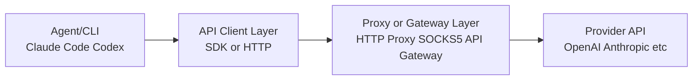

---
tags:
  - tutorial
  - vscode
  - claude
  - codex
  - proxy
  - gateway
  - api
---

# 网络代理与第三方网关接入

## 学习目标

- 理解何时必须配置网络代理，以及进程级配置与全局配置的区别。
- 掌握 Claude（通用设置 / VS Code 设置）与 Codex 的代理配置方法。
- 掌握第三方模型网关的接入三要素：Base URL、Key、模型名。
- 掌握网关接入检查表，能快速定位接入失败原因。

## 前置条件

- 已完成 [01_claude_code在vscode中的安装与配置](01_claude_code在vscode中的安装与配置.md) 与 [02_codex在vscode中的安装与配置](02_codex在vscode中的安装与配置.md)。
- 已了解"官方订阅 / API Key / 第三方网关"三种模式（参考 [00_多模型agent总览与订阅说明](00_多模型agent总览与订阅说明.md)）。

## 什么时候必须配代理

- 内网 / 校园网 / 企业网限制外网出口。
- 地区网络策略导致 API 不可达或高延迟。
- 需要抓包、审计、稳定出口 IP。

### 推荐的分层架构



分层价值：

- **可观测**：请求日志可统一收集。
- **可切换**：改网关或改模型不影响业务流程。
- **可控**：网络出口、ACL、限流、审计可统一执行。

## Claude 侧代理配置

Claude 的代理配置分两层（详见 [01_claude_code在vscode中的安装与配置](01_claude_code在vscode中的安装与配置.md) 第 2 步）。

### 方式一：Claude 通用设置（推荐）

写入 `~/.claude/settings.json`（用户级）或项目 `.claude/settings.json` 的 `env`，对 **CLI / 桌面端 / VS Code** 全部生效：

```json
{
  "$schema": "https://json.schemastore.org/claude-code-settings.json",
  "env": {
    "HTTP_PROXY": "http://127.0.0.1:1081",
    "HTTPS_PROXY": "http://127.0.0.1:1081",
    "ALL_PROXY": "socks5://127.0.0.1:1080"
  }
}
```

### 方式二：VS Code 设置（仅 VS Code 内生效）

在 VS Code `settings.json`（用户或工作区）中，通过 `claudeCode.env` 注入**进程内**环境变量（不污染全局 shell）：

```json
{
  "claudeCode.env": {
    "HTTP_PROXY": "http://127.0.0.1:1081",
    "HTTPS_PROXY": "http://127.0.0.1:1081",
    "ALL_PROXY": "socks5://127.0.0.1:1080"
  }
}
```

> `HTTPS_PROXY` 通常仍写 `http://proxy-host:port`（HTTP CONNECT 代理）；只有代理服务本身是 HTTPS 入口时才写 `https://...`。

### Claude 完整参考配置（第三方网关 + 代理）

通用设置版本（推荐，跨工具生效）：

```json
{
  "$schema": "https://json.schemastore.org/claude-code-settings.json",
  "env": {
    "ANTHROPIC_BASE_URL": "https://direct-api.example.com",
    "ANTHROPIC_API_KEY": "sk-xxx",
    "HTTP_PROXY": "http://127.0.0.1:1081",
    "HTTPS_PROXY": "http://127.0.0.1:1081",
    "ALL_PROXY": "socks5://127.0.0.1:1080"
  }
}
```

仅 VS Code 内生效的等价写法：

```json
{
  "claudeCode.env": {
    "ANTHROPIC_BASE_URL": "https://direct-api.example.com",
    "ANTHROPIC_API_KEY": "sk-xxx",
    "HTTP_PROXY": "http://127.0.0.1:1081",
    "HTTPS_PROXY": "http://127.0.0.1:1081",
    "ALL_PROXY": "socks5://127.0.0.1:1080"
  }
}
```

三个细节提醒：

- `ANTHROPIC_AUTH_TOKEN` 只有在你的网关明确要求该字段时使用；通用兼容场景更常见的是 `ANTHROPIC_API_KEY`。
- `ANTHROPIC_BASE_URL` 的层级按网关文档来：如果文档说明"会自动补 `/v1/messages`"，填域名根即可。
- JSON 必须严格合法（引号闭合、逗号位置正确）。

## Codex 侧代理配置

在 `~/.codex/.env` 中写入（Windows 为 `%USERPROFILE%\.codex\.env`）：

```env
https_proxy="http://127.0.0.1:1081"
http_proxy="http://127.0.0.1:1081"
all_proxy="socks5://127.0.0.1:1080"
```

### Codex 免登录 + API Key 配置

`~/.codex/auth.json`：

```json
{
  "OPENAI_API_KEY": "sk-xxx"
}
```

> 注意：如果 `config.toml` 使用 `env_key = "OPENAI_API_KEY"`，仅写 `auth.json` 仍可能报"找不到环境变量"。`env_key` 读取的是**进程环境变量**，需额外在 `~/.codex/.env` 或系统环境变量中提供。

## 第三方模型网关接入

第三方网关提供统一入口，后端转发到多个模型提供方。接入的核心是让 **Base URL + Endpoint + 请求体 Schema + 模型名** 四者一致。

### 网关接入检查表

- [ ] 网关是否支持你要的协议：Chat Completions / Responses / Messages（见 [04_接口模式选择与排错](04_接口模式选择与排错.md)）。
- [ ] 模型名是否完全匹配（大小写、版本号、日期后缀）。
- [ ] Key 是否对应当前网关租户和模型权限。
- [ ] Base URL 是否只填到要求的层级（域名根或 `/v1`）。
- [ ] 是否误把网页追踪参数（如 UTM）加到 API URL。

### Codex 自定义 Provider 示例

```toml
model = "gpt-5.4"
model_provider = "myproxy"

[model_providers.myproxy]
name = "My Proxy"
base_url = "https://gateway.example.com/v1"
wire_api = "responses"
env_key = "MY_PROXY_API_KEY"
```

配套在 `~/.codex/.env` 中添加：

```env
MY_PROXY_API_KEY="sk-xxx"
```

## 参考配置片段（可按需改写）

### Claude 全局配置（示意，通用设置版）

写入 `~/.claude/settings.json`：

```json
{
  "$schema": "https://json.schemastore.org/claude-code-settings.json",
  "env": {
    "ANTHROPIC_BASE_URL": "https://your-claude-gateway.example.com",
    "ANTHROPIC_API_KEY": "sk-...",
    "HTTP_PROXY": "http://127.0.0.1:1081",
    "HTTPS_PROXY": "http://127.0.0.1:1081",
    "ALL_PROXY": "socks5://127.0.0.1:1080"
  }
}
```

### Codex Provider 配置（示意）

```toml
model = "gpt-5.4"
model_provider = "gateway"

[model_providers.gateway]
name = "Team Gateway"
base_url = "https://gateway.example.com/v1"
wire_api = "responses"
env_key = "TEAM_GATEWAY_API_KEY"
```

## 常见问题

**Q：代理地址可达但请求仍超时？**
A：按"网络连通性 → TLS/证书 → 鉴权 → Endpoint → Schema → 模型名"顺序排查。先 `curl` 代理地址，再 `curl` API 健康接口。

**Q：网关能访问但模型报 `model unavailable`？**
A：endpoint 与 schema 不匹配，或模型名错误。先确认接口模式，再核对模型全名（大小写、版本后缀）。

**Q：配置了 Base URL 却报 `404/unknown route`？**
A：Base URL 层级填错或路径重复。回退到网关文档要求的层级（域名根或 `/v1`）。

**Q：`Invalid API key`？**
A：Key 错误、过期、权限不足或来源冲突。打印并核对实际生效的环境变量（注意 `auth.json` 与 `.env` 可能同时生效，优先级要确认）。

## 练习任务

1. 为本机配置一个 HTTP 代理，并分别验证 Claude Code 与 Codex 连通。
2. 通过第三方网关接入一个模型，逐项完成网关接入检查表。
3. 模拟一次"模型名写错"的报错，并按排查顺序定位。

## 验收清单

- [ ] 能说出进程级代理配置与全局配置的区别及推荐做法。
- [ ] 能正确配置 Claude 与 Codex 的代理变量。
- [ ] 能独立完成一个第三方网关的接入并验证连通。
- [ ] 能按固定顺序排查网关接入问题。
