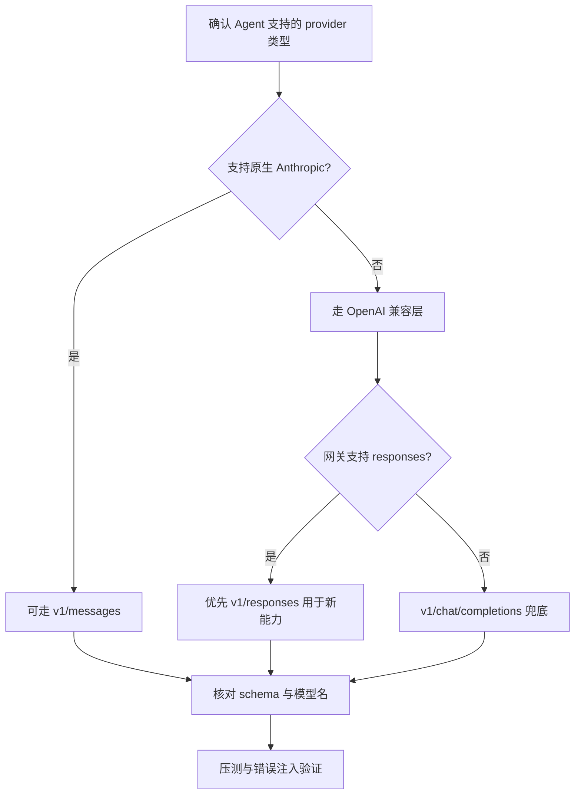

---
tags:
  - tutorial
  - agent
  - api
  - protocol
  - troubleshooting
---

# 接口模式选择与排错

## 学习目标

- 理解 `/v1/chat/completions`、`/v1/responses`、`/v1/messages` 三类接口的区别。
- 掌握"先客户端协议，后模型名；先 schema，后 endpoint"的选择口诀。
- 掌握在通用 Agent（可接多厂商模型的平台）中如何选择接口模式。
- 掌握常见错误矩阵与分层排查顺序。

## 前置条件

- 已完成 [00_agent基础与接口知识](00_agent基础与接口知识.md)，掌握 Base URL / API Key / 模型名三要素与三类协议概述。
- （可选）了解第三方网关概念（参考 [section12/03](../section12/03_网络代理与第三方网关接入.md)）。

## 三类接口协议：怎么选才不会错

### 一张表记住

| 接口                   | 典型生态            | 典型请求骨架                               | 适用场景                               |
| :--------------------- | :------------------ | :----------------------------------------- | :------------------------------------- |
| `/v1/chat/completions` | OpenAI 兼容         | `model + messages[]`                       | 最广泛兼容，传统聊天/编码工具          |
| `/v1/responses`        | OpenAI 新 Responses | `model + input (+tools)`                   | 新工作流、工具调用、多模态、结构化输出 |
| `/v1/messages`         | Anthropic 原生      | `model + max_tokens + system + messages[]` | Claude 原生 SDK/客户端                 |

### 选择算法（通用 Agent 必看）

1. 看客户端文档的"请求体字段"。
2. 若核心字段是 `messages`（OpenAI 风格）→ 优先 `chat/completions`。
3. 若核心字段是 `input` / `response items` → `responses`。
4. 若明确是 Anthropic schema（顶层 `system` 等）→ `messages`。
5. 再验证网关是否支持该接口。

> 口诀：**先客户端协议，后模型名；先 schema，后 endpoint。**

## 通用 Agent（Copilot 类）如何选择接口模式

这里的"通用 Agent"指可以接多厂商模型的平台 / 插件 / IDE 助手，不绑定某一家协议。

### 推荐决策流程



### 实际建议

- 追求**最大兼容性**：先用 `/v1/chat/completions`。
- 需要工具调用、结构化输出、统一多模态：优先 `/v1/responses`。
- 明确使用 Claude 原生 SDK/能力：用 `/v1/messages`。
- 同一团队多工具并存时：**网关层统一协议映射**，业务侧只暴露一套配置模板。

### 配置模板策略（团队协作）

建议维护三份模板：

- **Template A**：OpenAI 兼容（chat/completions）
- **Template B**：OpenAI responses
- **Template C**：Anthropic messages

并在 README 中明确：

- 适用工具
- 最小字段
- 示例模型名
- 常见报错与修复命令

## 常见错误与快速排查

### 错误矩阵

| 现象                          | 高概率原因                                       | 快速修复                           |
| :---------------------------- | :----------------------------------------------- | :--------------------------------- |
| model unavailable / not found | endpoint 与 schema 不匹配；模型名错误            | 先确认接口模式，再核对模型全名     |
| invalid request body          | 请求体字段用错（把 `messages` 发到 `responses`） | 按目标接口重写 body                |
| 404/unknown route             | Base URL 填错或路径重复                          | Base URL 回退到文档要求层级        |
| Invalid API key               | Key 错误、过期、权限不足、来源冲突               | 打印并核对实际生效环境变量         |
| 超时/连接拒绝                 | 代理不可达、隧道断开、DNS/ACL 问题               | 先 curl 代理，再 curl API 健康接口 |
| 工具里可见模型但调用失败      | 网关列模型不代表该 endpoint 可用                 | 用目标 endpoint 单独做最小请求测试 |

### 分层排查顺序（强烈推荐）

1. **网络层**：代理地址可达吗？
2. **传输层**：TLS/证书是否正常？
3. **鉴权层**：Key 是否生效？
4. **路由层**：endpoint 是否正确？
5. **协议层**：request schema 是否匹配？
6. **业务层**：模型名和权限是否匹配？

## 最小验证脚本思路

为每个接口各准备一个"最小请求"脚本（只保留必须字段），用于 CI 或本地 smoke test：

- `test_chat_completions.sh`
- `test_responses.sh`
- `test_messages.sh`

每次改网关、改模型、改代理后，**先跑三组最小测试，再接入正式 Agent**。

### 示例：chat/completions 最小请求

```bash
curl -sS https://gateway.example.com/v1/chat/completions \
  -H "Authorization: Bearer $API_KEY" \
  -H "Content-Type: application/json" \
  -d '{
    "model": "gpt-5.6-luna",
    "messages": [{"role": "user", "content": "你好"}]
  }'
```

### 示例：responses 最小请求

```bash
curl -sS https://gateway.example.com/v1/responses \
  -H "Authorization: Bearer $API_KEY" \
  -H "Content-Type: application/json" \
  -d '{
    "model": "gpt-5.6-luna",
    "input": "你好"
  }'
```

### 示例：messages 最小请求

```bash
curl -sS https://api.anthropic.com/v1/messages \
  -H "x-api-key: $ANTHROPIC_API_KEY" \
  -H "anthropic-version: 2023-06-01" \
  -H "Content-Type: application/json" \
  -d '{
    "model": "claude-sonnet-4-6",
    "max_tokens": 1024,
    "messages": [{"role": "user", "content": "你好"}]
  }'
```

> 以上模型名与字段为示意，请替换为你的网关 / 官方文档中的实际值。

## 常见问题

**Q：为什么模型名看起来对，却一直 `model unavailable`？**
A：可能 endpoint 与 schema 不匹配。例如模型挂在 `responses` 接口下，你却发到 `chat/completions`。先确认接口模式，再核对模型全名。

**Q：`invalid request body` 怎么办？**
A：请求体字段用错了。对照目标接口的最小请求骨架重写 body（`messages` 与 `input` 不可混用）。

**Q：如何确认 Base URL 是否填对？**
A：看网关文档要求的层级（域名根或 `/v1`），并用抓包或请求日志确认最终 URL，避免路径重复。

**Q：团队多工具并存怎么统一配置？**
A：在网关层做协议映射，业务侧只维护三份模板（chat / responses / messages），并在 README 说明适用工具与报错修复命令。

## 练习任务

1. 对同一个网关模型分别用 `chat/completions` 与 `responses` 发最小请求，观察报错差异。
2. 为你的团队整理一份"接口模式选择速查表"。
3. 人为制造一次"Base URL 层级错误"，用分层排查顺序定位并修复。

## 验收清单

- [ ] 能说出三类接口的典型请求骨架与适用场景。
- [ ] 能按口诀"先客户端协议，后模型名"完成选择。
- [ ] 能使用错误矩阵快速定位常见问题。
- [ ] 能为每个接口编写最小验证请求。
