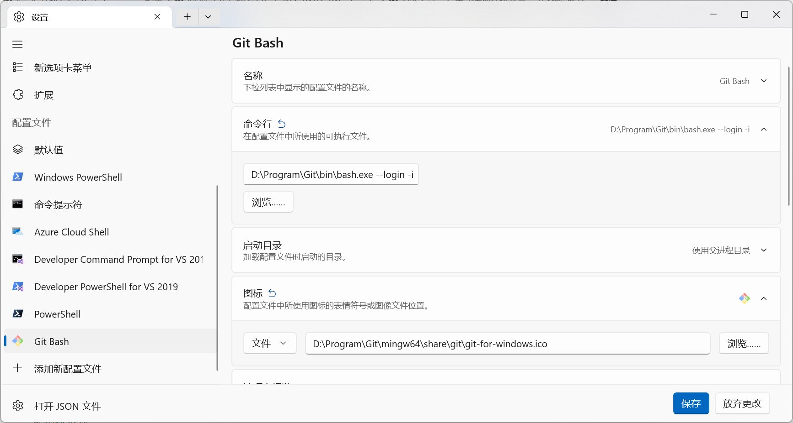

---
tags:
  - tutorial
  - agent
  - environment
  - gitbash
  - ripgrep
---

# 运行环境：Git Bash 与 ripgrep 配置

## 学习目标

- 理解为什么 Agent / Skill 会调用 `bash` 脚本，以及 Windows 下如何提供 `bash`。
- 掌握把 Git Bash 的 `bash` 加入环境变量（PATH）的方法。
- 理解 `rg`（ripgrep）的作用，以及为什么除 VS Code 外还需要系统级安装。
- 掌握 `rg` 的安装与验证方法。

## 前置条件

- 已完成 [section9/02](02_运行环境_python与nodejs安装.md)（或已了解终端操作）。
- 已安装 Git（参考 [section1/03](../section1/03_git和github安装与登录.md)）。

## 为什么需要 bash

很多 Skill 与 Agent 的自动化步骤是 **bash 脚本**（如 `build.sh`、`deploy.sh`），或在终端执行 `bash -c "..."`。这类脚本在 Linux / macOS 上天然可用，但在 **Windows 上默认没有 `bash` 命令**，需要借助随 Git 一起安装的 **Git Bash**。

## 第 1 步：确认 bash 是否可用

打开终端，执行：

```bash
bash --version
```

- 若显示 `GNU bash, version ...`，说明 `bash` 已可用（通常是你安装 Git 时选择了把 Git 加入 PATH）。
- 若提示"不是内部或外部命令"，说明 `bash` 未加入 PATH，需要按下一步配置。

也可以查看 `bash` 所在位置：

```bash
where bash
```

## 第 2 步：把 Git Bash 加入 PATH（Windows）

Git 安装目录下通常存在 `bin\bash.exe`。常见安装路径为 `C:\Program Files\Git\bin` 或 `C:\Program Files\Git\usr\bin`。

### 方法一：检查安装时的 PATH 选项（推荐先确认）

安装 Git 时，在 **Adjusting your PATH environment** 一步选择：

- **"Git from the command line and also from 3rd-party software"**（推荐）—— 会把 `C:\Program Files\Git\bin` 加入 PATH。

如果你当初选择了其他选项，可手动添加。

### 方法二：手动添加环境变量

1. 按 `Win` 键，搜索"**编辑系统环境变量**"并打开。
2. 点击 **环境变量** → 在 **系统变量** 或 **用户变量** 中找到 `Path`。
3. 点击 **编辑** → **新建**，添加：`C:\Program Files\Git\bin`（按你的实际安装路径调整）。
4. 确定保存，**重启终端 / VS Code** 使生效。
5. 再次运行 `bash --version` 验证。

> [!tip] 加 `bin` 而非只加 `usr\bin`
> `bash.exe` 位于 `Git\bin` 下，同时该目录还提供 `sh` 等常用命令。若只加 `usr\bin`，部分命令可能仍找不到。

### 方法三：在 Windows 终端中添加 Git Bash 配置文件

即使 `bash` 已加入 PATH，Windows Terminal 默认只显示 PowerShell 和命令提示符。若想在 Windows Terminal 的下拉菜单中直接选择 Git Bash，需要手动添加一个配置文件：

1. 打开 **Windows Terminal**，按 `Ctrl + ,` 进入 **设置**。
2. 点击左下角 **添加新配置文件** → **新建空配置文件**。
3. 填写以下字段：

| 字段       | 值                                                     |
| ---------- | ------------------------------------------------------ |
| **名称**   | `Git Bash`                                             |
| **命令行** | `C:\Program\Git\bin\bash.exe --login -i`               |
| **图标**   | `C:\Program\Git\mingw64\share\git\git-for-windows.ico` |

> [!note-blank|caption]
>
> 
>
> Windows 终端 Git Bash 配置示例。图中的 `C:\Program\Git\...` 仅为示例，你的 Git 安装路径可能不同。可通过文件资源管理器导航到 Git 安装目录确认实际路径。

> [!tip] 命令行参数说明
> `--login` 让 bash 读取 profile 文件初始化环境，`-i` 表示交互式 shell。两个参数缺一不可，否则进入的终端可能缺少 PATH 等环境变量。

## 为什么需要 rg（ripgrep）

`rg` 是一个**极速文本搜索工具**，被 VS Code 内置搜索作为底层引擎使用。在 VS Code / Copilot 中通常无需关心它，因为：

- **VS Code 内置了 rg**，搜索功能自动使用。
- **Copilot 能调用 VS Code 的内置工具**，不需要系统里的 `rg`。

但**其他 Agent（尤其是终端 CLI，如 Claude Code、Codex CLI）或独立 Skill** 不一定有内置搜索能力，或模型选择调用外部 `rg` 命令来搜索代码。此时若系统未安装 `rg`，Agent 会报"`rg: command not found`"。因此建议**在系统级安装 rg**，让所有工具都能直接调用。

## 第 3 步：安装 rg

### Windows（推荐 winget）

```bash
winget install BurntSushi.ripgrep.MSVC
```

### Windows（Scoop / Chocolatey）

```bash
# Scoop
scoop install ripgrep

# Chocolatey
choco install ripgrep
```

### macOS（Homebrew）

```bash
brew install ripgrep
```

### Linux（系统包管理器）

```bash
# Debian / Ubuntu
sudo apt install ripgrep

# Fedora
sudo dnf install ripgrep

# Arch
sudo pacman -S ripgrep
```

### 手动安装（任意平台）

从 [ripgrep GitHub Releases](https://github.com/BurntSushi/ripgrep/releases) 下载对应平台的压缩包，解压后把 `rg` 可执行文件所在目录加入 PATH。

## 第 4 步：验证 rg

重启终端后执行：

```bash
rg --version
```

应显示 `ripgrep ... (rev ...)`。再做一个快速搜索测试：

```bash
rg "学习目标" section9/
```

能输出文件与行号即说明安装成功。

## 常见问题

### Q：安装了 Git，但 `bash` 还是找不到？

多为 PATH 未生效。手动添加 `C:\Program Files\Git\bin` 后**重启终端**；若仍不行，检查 Git 实际安装路径（不一定在默认位置）。

### Q：VS Code 里搜索正常，还需要装 rg 吗？

如果你**只用 VS Code / Copilot**，可以不装。但一旦使用终端型 Agent 或独立 Skill，建议安装，避免它们因找不到 `rg` 而失败。

### Q：`winget` 不是内部命令？

`winget` 需要较新的 Windows 10/11。旧系统可用 Scoop / Chocolatey，或从 GitHub Releases 手动安装。

## 练习任务

1. 运行 `bash --version`，确认 Windows 下 `bash` 可用；若不可用，按本教程加入 PATH。
2. 运行 `rg --version` 确认已安装。
3. 用 `rg` 在本仓库中搜索一个关键词（如 `copilot`），观察输出格式。
4. 让一个终端型 Agent（如 `claude` 或 `codex` CLI）执行一次搜索任务，确认其能正常调用 `rg`。

## 验收清单

- [ ] Windows 下 `bash --version` 可正常输出。
- [ ] 知道如何把 Git Bash 的 `bin` 目录加入 PATH。
- [ ] `rg --version` 可正常输出。
- [ ] 能解释"VS Code 内置搜索正常，但终端 Agent 报 rg 找不到"的原因。
