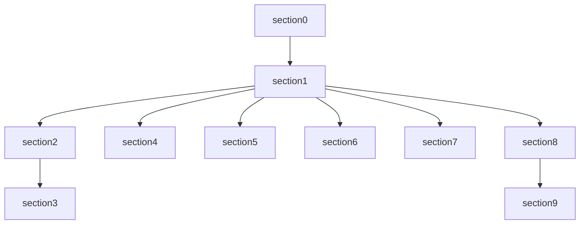

---
tags:
  - tutorial
  - learning-path
  - prerequisites
---

# 学习路径与先修要求

## 学习目标

- 明确本教程的目标学员画像。
- 了解不同角色应该如何选择学习路径。
- 掌握各章节的预估耗时与依赖关系。
- 根据自身情况制定学习计划。

## 目标学员

本教程适合以下人群：

| 角色           | 背景                                             | 学习目标                                     |
| :------------- | :----------------------------------------------- | :------------------------------------------- |
| **笔记新手**   | 从未使用过 Markdown / Obsidian，想建立个人知识库 | 掌握 Obsidian 基础操作与 Markdown 写作       |
| **团队协作者** | 需要在团队中共同维护文档，使用版本控制           | 掌握 Git 可视化协作流程与 Obsidian 多人协作  |
| **技术写作者** | 需要高效产出技术文档，希望用 AI 辅助             | 掌握 Copilot 辅助写作、prompt/skill/mcp 进阶 |
| **教程贡献者** | 希望参与本教程的完善与迭代                       | 理解仓库结构与协作规范，按 agent 工作流推进  |

## 先修要求

### 硬性要求

- 会使用电脑的基本操作（文件管理、软件安装、浏览器使用）。
- 有一台可上网的电脑（Windows / macOS / Linux 均可）。

### 推荐具备（非强制）

- 了解什么是"纯文本"（与 Word 相对）。
- 曾经写过简单的 Markdown 笔记（如 GitHub README）。
- 听说过 Git 版本控制的基本概念。

> 以上推荐条件**即使不满足也没关系**，对应的知识点都会在教程中覆盖。

## 学习路径

### 路径 A：完整路线（推荐）

适合从零开始的学员，按章节顺序学习。

| 顺序 | 章节     | 主题            | 预估耗时  | 前置依赖 |
| :--- | :------- | :-------------- | :-------- | :------- |
| 0    | section0 | 课程导读        | 15 min    | 无       |
| 1    | section1 | 环境安装        | 30–45 min | 无       |
| 2    | section2 | Markdown 基础   | 1–2 h     | section1 |
| 3    | section3 | Markdown 扩展   | 1–2 h     | section2 |
| 4    | section4 | Git 可视化协作  | 1–2 h     | section1 |
| 5    | section5 | Obsidian Canvas | 1 h       | section1 |
| 6    | section6 | Obsidian Bases  | 1 h       | section1 |
| 7    | section7 | Syncthing 同步  | 30 min    | section1 |
| 8    | section8 | Copilot 基础    | 1–2 h     | section1 |
| 9    | section9 | Copilot 实战    | 2–3 h     | section8 |

> 总预估耗时：**约 10–15 小时**（可在一周内完成）。

### 路径 B：写作速成（Markdown 方向）

适合只想学 Markdown 写作的学员。

```
section0  →  section1  →  section2  →  section3
```

完成此路径后，你可以：

- 写出规范的 Markdown 笔记。
- 使用表格、Mermaid 图表、数学公式、Callout 等扩展语法。
- 在 Obsidian 和 VS Code 中实时预览渲染效果。

### 路径 C：协作速成（Git 方向）

适合想快速上手团队协作的学员。

```
section0  →  section1  →  section4
```

完成此路径后，你可以：

- 使用 VS Code 图形化界面完成克隆、暂存、提交、推送。
- 创建分支、发起 PR、处理冲突。

### 路径 D：AI 进阶（Copilot 方向）

适合已有 Markdown 基础、想用 AI 提效的学员。

```
section0  →  section1  →  (section2 可选)  →  section8  →  section9
```

完成此路径后，你可以：

- 使用 Copilot 对话生成文档草稿。
- 编写自定义 prompt 和 instruction 文件。
- 接入 MCP 工具（如 Tavily 搜索）扩展 Copilot 能力。

## 章节依赖关系图



> 箭头表示前置依赖：必须先完成箭头起点的章节。

## 学习建议

### 时间安排

- **每日 1 小时**：约 2 周完成完整路线。
- **每日 2 小时**：约 1 周完成完整路线。
- **集中冲刺**：一个周末（约 10 小时）完成核心路径（section0–section4）。

### 学习技巧

1. **边学边练**：每个章节的"练习任务"务必动手操作，只读不练效果大打折扣。
2. **自检验收**：每节末尾的"验收清单"是自检工具，全部打勾再进入下一节。
3. **遇到问题先查 FAQ**：每个章节都附有常见问题，多数疑问可在其中找到答案。
4. **善用扩展阅读**：每节末尾的"扩展阅读"链接了官方文档，适合深入学习。

## 常见问题

**Q：我跳过了 section0 直接学 section1 可以吗？**
A：可以。section0 主要是框架性说明，如果习惯直接动手，可以从 section1 开始，之后再回来看。

**Q：预估耗时包含练习时间吗？**
A：包含。每节的估算已计入阅读文档+完成练习的时间。

**Q：如果某个章节卡住了怎么办？**
A：先查看该节的"常见问题"段落；如仍未解决，可提交 Issue 或在团队内讨论。

## 练习任务

1. 根据自身背景，选择一条学习路径（A/B/C/D）。
2. 制定个人学习计划（每天学哪几节，预计何时完成）。
3. 打开 `README.md`，确认自己理解仓库的整体结构。

## 验收清单

- [ ] 明确自己的目标学员角色
- [ ] 确认满足先修要求
- [ ] 选择了一条适合自己的学习路径
- [ ] 制定了初步的学习时间计划
- [ ] 了解各章节的依赖关系
