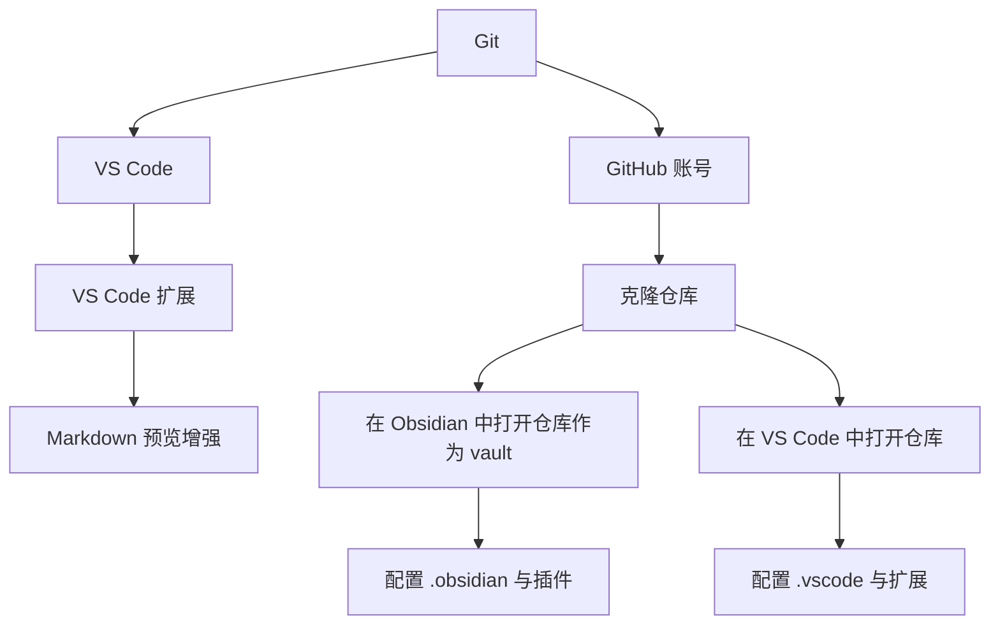
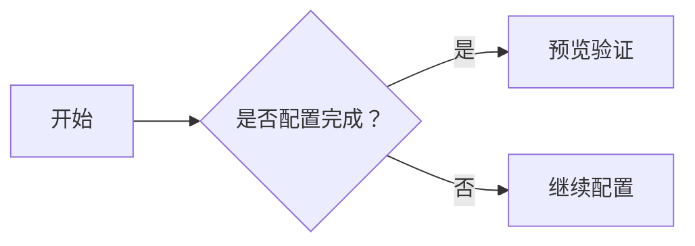

---
tags:
  - tutorial
  - environment
  - setup
---

# 环境安装总览

## 学习目标

- 了解本教程所需工具的安装顺序与依赖关系。
- 完成 Obsidian、VS Code、Git 三件套的安装与基础配置。
- 验证仓库文档中的扩展语法（Callout、Mermaid、数学公式、自定义样式）可正常渲染。
- 预计耗时：**30–45 分钟**（新机器）。

## 工具安装依赖关系

**安装顺序建议**：

1. **Git** —— 版本管理基础，后面克隆仓库需要。
2. **GitHub 账号** —— 注册并登录，用于远程协作。
3. **VS Code** —— 主力编辑器，安装后克隆仓库。
4. **Obsidian** —— 知识管理工具，以仓库文件夹为 vault 打开。
5. **扩展与配置** —— VS Code 安装扩展；Obsidian 复制 `.obsidian.default` 一键应用配置。

## 安装清单

| 步骤 | 工具         | 说明                       | 文档                                                      |
| ---- | ------------ | -------------------------- | --------------------------------------------------------- |
| 1    | Git          | 版本控制，克隆与提交仓库   | [→ 03_git和github安装与登录](03_git和github安装与登录.md) |
| 2    | GitHub 账号  | 远程协作平台               | [→ 03_git和github安装与登录](03_git和github安装与登录.md) |
| 3    | VS Code      | 代码编辑器，Git 可视化操作 | [→ 02_vscode安装与配置](02_vscode安装与配置.md)           |
| 4    | Obsidian     | 知识管理，Markdown 预览    | [→ 01_obsidian安装与配置](01_obsidian安装与配置.md)       |
| 5    | 字体（可选） | 霞鹜文楷（提升阅读体验）   | [→ 01_obsidian安装与配置](01_obsidian安装与配置.md)       |

## 渲染验收清单

安装与配置完成后，请在本仓库中打开以下验证项，确认所有扩展语法可正常显示：

### 1. Callout（警告框）

> [!note] 这是一个 Callout
> Callout 是 Obsidian 的核心功能之一，用于突出显示笔记、警告或提示信息。
>
> 如果这段文字显示在带颜色的卡片框中，则 **Callout 渲染正常**。

### 2. Mermaid 图表

如果上面出现一个流程图（带方框和箭头），则 **Mermaid 渲染正常**。

### 3. 数学公式

行内公式：$E = mc^2$

块级公式：

$$
\int_{-\infty}^{\infty} e^{-x^2} dx = \sqrt{\pi}
$$

如果以上公式正确显示为数学符号（非 LaTeX 源码），则 **数学公式渲染正常**。

### 4. 自定义样式

以下文字应显示为不同颜色或样式（取决于已加载的主题/样式文件）：

这段文字应为红色。

这段文字应为蓝色。

### 验收结果表

| 检查项       | 预期效果              | 状态 |
| ------------ | --------------------- | ---- |
| Callout      | 彩色卡片框            | □    |
| Mermaid 图表 | 流程图/时序图正常显示 | □    |
| 数学公式     | 正确渲染为数学符号    | □    |
| 自定义样式   | 颜色/字体效果正确     | □    |

> [!tip] 如果渲染异常
>
> - 请确认已安装对应的 VS Code 扩展（详见 [02_vscode安装与配置](02_vscode安装与配置.md)）。
> - 在 Obsidian 中请确认已开启必要的核心插件与社区插件。
> - 检查 `.obsidian` 和 `.vscode` 配置文件夹是否已从 `.default` 副本创建。

## 前置条件

- 一台可以上网的电脑（Windows / macOS / Linux 均可）。
- 基本的文件操作能力（下载、解压、复制文件夹）。
- 本仓库已克隆到本地（详见 [03_git和github安装与登录](03_git和github安装与登录.md)）。

## 常见问题

**Q：安装顺序错了怎么办？**
A：没有严格要求，但建议按 Git → VS Code → Obsidian 的顺序，可以减少重复操作。

**Q：能否只安装其中一部分？**
A：可以。但至少需要 Git + 一个编辑器（VS Code 或 Obsidian）才能正常参与协作。

**Q：安装后看不到效果？**
A：请先检查是否已打开本仓库文档；部分扩展需要重启编辑器才能生效。

## 练习任务

1. 按顺序完成 Git、VS Code、Obsidian 的安装。
2. 打开本文件，确认上方四项渲染验收均通过。
3. 在验收结果表中将对应的 □ 标记为 ☑。

## 验收清单

- [ ] 确认 Git 已安装并可运行
- [ ] 确认 VS Code 已安装并完成扩展配置
- [ ] 确认 Obsidian 已安装并以本仓库为 vault 打开
- [ ] 确认 Callout、Mermaid、数学公式、自定义样式均可正常渲染
