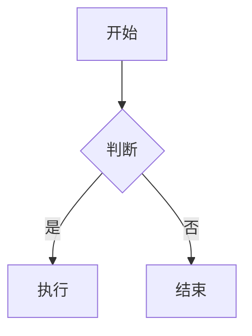
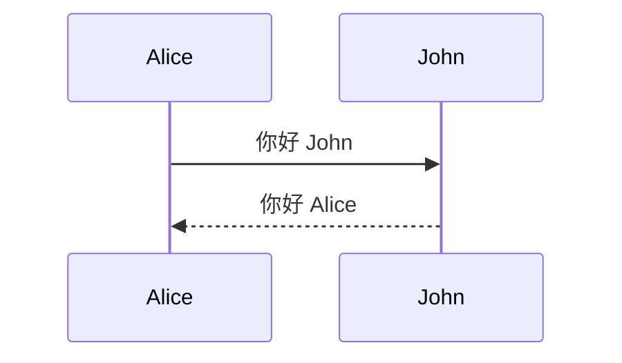
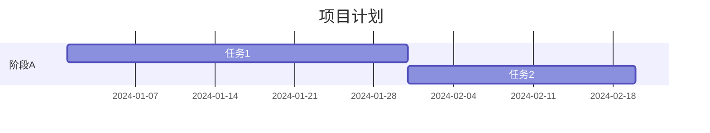

---
tags:
  - tutorial
  - markdown
  - extended
  - obsidian
---

# Markdown 扩展与 Obsidian 语法

## 学习目标

- 掌握表格、围栏代码块、脚注、删除线、任务列表、Emoji 等扩展语法。
- 掌握 Mermaid 图表与数学公式的编写。
- 掌握 Obsidian 特色语法：高亮、Callout（警告框）、WikiLink 与链接嵌入。

## 前置条件

- 已掌握 Markdown 基础语法（参考 [section2](../section2/)）。
- 已安装支持扩展语法的编辑器（VS Code 推荐扩展或 Obsidian）。

## 扩展语法

以下语法在标准 Markdown 基础上扩展而来，大部分 Markdown 应用程序（包括 VS Code 和 Obsidian）均已支持。

### 1. 表格

使用 `|` 分隔列，使用 `---` 分隔表头与表体。

```markdown
| 左对齐 | 居中对齐 | 右对齐 |
| :----- | :------: | -----: |
| 单元格 |  单元格  | 单元格 |
```

对齐方式由冒号位置控制：

| 符号    | 效果     |
| :------ | :------- |
| `:---`  | 左对齐   |
| `:---:` | 居中对齐 |
| `---:`  | 右对齐   |

> [!warning] 注意
>
> 表格单元格中不要出现竖线 `|`，如需显示请使用 HTML 实体 `&#124;`。

### 2. 围栏代码块

使用三个反引号 <code>```</code> 包裹代码块，并可在开头指定编程语言以启用语法高亮。

````markdown
```python
def hello():
    print("Hello, World!")
```
````

支持的语言包括 `python`、`javascript`、`json`、`bash`、`html`、`css` 等。

### 3. 脚注

脚注用于添加注释而不干扰正文阅读。

```markdown
这是一段带脚注的文字。[^1]

[^1]: 这是脚注的内容。
```

> 脚注标识符可以是数字或单词，但不能包含空格。脚注会自动编号。

### 4. 删除线

在文字前后添加两个波浪号 `~~` 表示删除。

```markdown
~~这是被删除的文字。~~
```

效果：~~这是被删除的文字。~~

### 5. 任务列表

在列表项前添加 `- [ ]`（未完成）或 `- [x]`（已完成）。

```markdown
- [x] 已完成的任务
- [ ] 待完成的任务
- [ ] 另一个待办
```

> [!tip] 扩展任务状态
>
> Obsidian 搭配特定主题（如 Border）还支持更多任务状态：`[-]`（已取消）、`[/]`（进行中）、`[>]`（已重新安排）等。

### 6. Emoji 表情

输入以冒号包裹的 Emoji 短代码即可插入表情符号。

```markdown
去露营了！ :tent: 很快回来。
:joy: :rocket: :+1:
```

> 常见短代码列表可参考 [Emoji 短代码参考](https://gist.github.com/rxaviers/7360908)。

### 7. 自动网址链接

大多数 Markdown 处理器会自动将 URL 文本转换为可点击的链接。

```
https://markdown.com.cn
```

如果不希望自动链接，可将 URL 用反引号包裹：`` `https://example.com` ``

### 8. Mermaid 图表

Mermaid 允许用文本和代码创建图表。使用围栏代码块并指定语言为 `mermaid`。

**流程图：**

````markdown

````

**时序图：**

````markdown

````

**甘特图：**

````markdown

````

> 更多示例可参考 [Mermaid 官方文档](https://mermaid.js.org/)。

### 9. 数学公式

Markdown 通过 LaTeX 语法支持数学公式。

**行内公式**：使用单个 `$` 包裹。

```markdown
质能方程：$E = mc^2$
圆的面积：$A = \pi r^2$
```

**块级公式**：使用双 `$$` 包裹，公式单独成行居中显示。

```markdown
$$
\int_{-\infty}^{\infty} e^{-x^2} dx = \sqrt{\pi}
$$

$$

\sum_{n=1}^{\infty} \frac{1}{n^2} = \frac{\pi^2}{6}
$$
```

> [!tip] 兼容性
>
> - VS Code 使用 KaTeX 渲染，Obsidian 使用 MathJax 渲染。二者对部分 LaTeX 命令的支持程度略有差异。
> - Obsidian 中行内公式的 `$` 内侧不能有空格，且外侧通常需要空格：`公式 $E = mc^2$ 示例` ✅

---

## Obsidian 扩展语法

以下语法为 Obsidian 特有，在其他 Markdown 处理器中可能不受支持。

### 10. 高亮

在文字前后添加两个等号 `==` 实现荧光笔效果。

```markdown
这是一段 ==重要内容==。
```

### 11. Callout（警告框）

Callout 是 Obsidian 的核心功能，用于突出显示不同类型的信息。在引用的开头添加 `> [!类型]`。

**基本用法：**

```markdown
> [!note] 标题（可选）
> 这是 Callout 的内容。
```

**支持的类型：**

| 类型                     | 说明      |
| :----------------------- | :-------- |
| `[!note]`                | 常规提示  |
| `[!tip]` / `[!hint]`     | 技巧提示  |
| `[!info]`                | 信息提示  |
| `[!warning]`             | 警告      |
| `[!danger]`              | 危险      |
| `[!success]` / `[!done]` | 成功/完成 |
| `[!question]` / `[!faq]` | 问题/FAQ  |
| `[!bug]`                 | 缺陷      |
| `[!example]`             | 示例      |
| `[!quote]` / `[!cite]`   | 引用      |

**可折叠变体：**

```markdown
> [!note]+ 默认展开
> 内容

> [!note]- 默认折叠
> 内容
```

> [!tip] 兼容性
>
> - 在不支持 Callout 的 Markdown 处理器中，会按普通引用显示。
> - 建议在 keyword 和内容之间空一行，提高兼容性。

### 12. WikiLink

Obsidian 支持 WikiLink 格式的内部链接。

**链接到笔记：**

```markdown
[[笔记名]]
[[笔记名|显示文字]]
```

**链接到标题：**

```markdown
[[#标题]]
[[笔记名#标题]]
```

**链接到块：**

在行尾添加 `^块标识符` 创建块引用：

```markdown
[[2024-01-01#^37066d]]
```

> 输入 `^` 时 Obsidian 会弹出建议列表帮助选择。

### 13. 链接嵌入

在 WikiLink 前加感叹号 `!` 可嵌入内容。

**嵌入图片：**

```markdown
![[Figure 1.png]]
![[Figure 1.png|200]] <!-- 自定义宽度 -->
```

**嵌入笔记：**

```markdown
![[笔记名]]
![[笔记名#标题]] <!-- 嵌入特定章节 -->
```

**嵌入音频/视频：**

```markdown
![[录音.ogg]]
![[演示.mp4]]
```

**嵌入 PDF：**

```markdown
![[文档.pdf]]
![[文档.pdf#page=3]] <!-- 指定页码 -->
```

### 14. 转义字符

在 Markdown 特殊字符前加反斜杠 `\` 可显示字符本身而非其格式含义。

```markdown
\* 这不是列表项
\# 这不是标题
```

常用需要转义的字符：`\` `` ` `` `*` `_` `{}` `[]` `()` `#` `+` `-` `.` `!` `|`

---

## 扩展阅读

- [Mermaid 官方文档](https://mermaid.js.org/)
- [Obsidian Callout 文档](https://help.obsidian.md/callouts)
- [Obsidian 链接文档](https://help.obsidian.md/links)
- [KaTeX 支持的命令列表](https://katex.org/docs/supported.html)
- [Markdown 扩展语法 (markdown.com.cn)](https://markdown.com.cn/extended-syntax/)

## 常见问题

**Q：Mermaid 图表在 VS Code 预览中不显示？**
A：请确认已安装 "Markdown Preview Mermaid Support" 扩展。

**Q：数学公式渲染为 LaTeX 源码？**
A：检查公式的 `$` 包裹是否正确；Obsidian 中行内公式 `$` 内侧不能有空格。

**Q：Callout 在 VS Code 中显示为普通引用？**
A：需要安装 `vscode-markdown-obsidian-alert` 扩展。

**Q：WikiLink 在 VS Code 中不生效？**
A：VS Code 默认不支持 Obsidian WikiLink 格式，建议在 Obsidian 中查看或安装相关扩展。

## 练习任务

完成本章学习后，请前往 [01_mermaid公式脚注任务清单](01_mermaid公式脚注任务清单.md) 完成配套练习。

## 验收清单

- [ ] 能创建表格并控制列对齐方式
- [ ] 能使用围栏代码块并指定语言
- [ ] 能添加脚注
- [ ] 能使用 `~~` 创建删除线
- [ ] 能创建任务列表并标记完成状态
- [ ] 能编写 Mermaid 流程图和时序图
- [ ] 能编写行内公式和块级数学公式
- [ ] 能使用 `==` 高亮文本
- [ ] 能使用不同类型的 Callout
- [ ] 能使用 WikiLink 链接笔记、标题和块
- [ ] 能使用 `![[ ]]` 嵌入图片、笔记和 PDF
