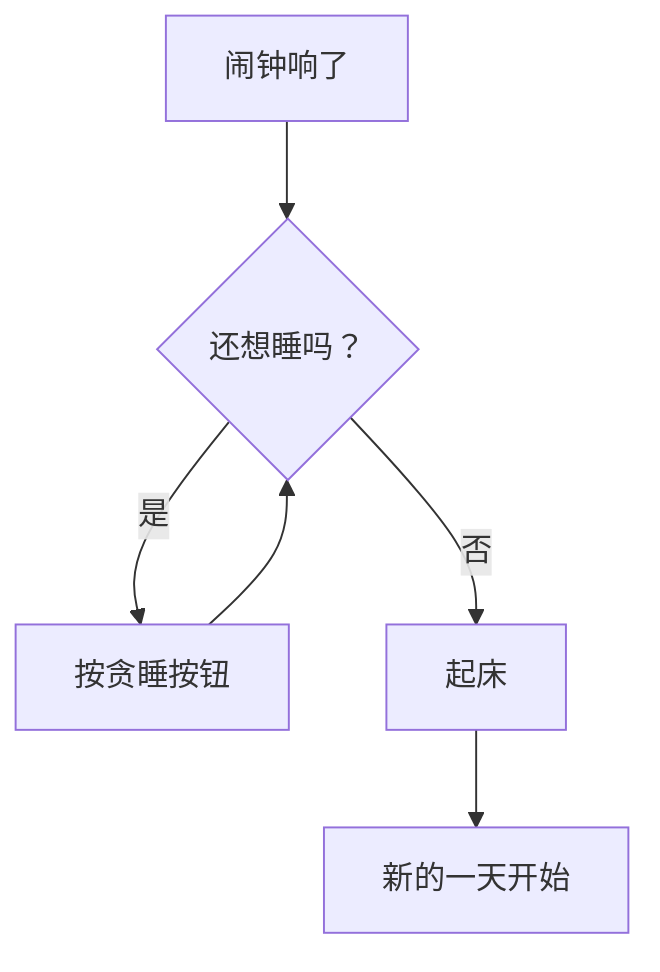
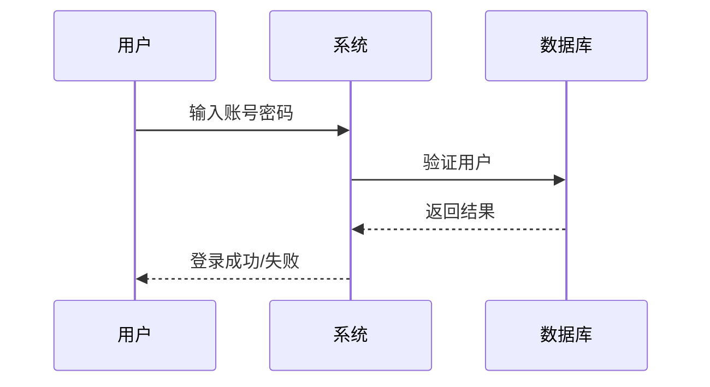
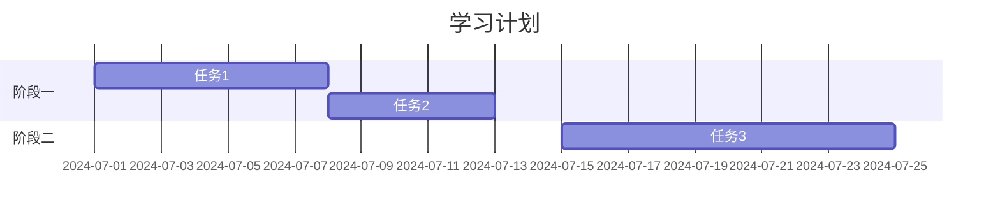

---
tags:
  - tutorial
  - markdown
  - exercise
  - mermaid
  - math
---

# Mermaid、公式、脚注与任务清单练习

## 学习目标

- 通过专项练习巩固表格、脚注、删除线、任务列表的用法。
- 掌握 Mermaid 图表的编写与调试。
- 掌握数学公式的 LaTeX 编写。
- 综合运用 Callout 与 WikiLink。

## 前置条件

- 已阅读 [00_markdown扩展与obsidian语法](00_markdown扩展与obsidian语法.md)。
- 确保编辑器支持 Mermaid 渲染（VS Code 需安装 "Markdown Preview Mermaid Support"）。

## 练习说明

以下练习按知识点分组，由浅入深。建议在编辑器中打开本文件并开启预览，一边编辑一边观察渲染效果。

---

## 练习 1：表格

### 1a. 基础表格

创建一个显示一周课程表的表格，包含以下列：时间、周一、周二、周三、周四、周五。

<!-- 在此处开始练习 -->

### 1b. 对齐控制

创建一个包含三列的表格，分别测试左对齐、居中对齐、右对齐。

| 左对齐（默认） | 居中对齐  |    右对齐 |
| :------------- | :-------: | --------: |
| 单元格 A1      | 单元格 A2 | 单元格 A3 |
| 单元格 B1      | 单元格 B2 | 单元格 B3 |

在下方复制上面的表格，修改 `---` 行的冒号位置，观察对齐变化。

<!-- 在此处开始练习 -->

---

## 练习 2：脚注

在下方写一段包含两个脚注的文字。

例如：Markdown 由 John Gruber 创建[^1]，而扩展语法由社区贡献[^2]。

<!-- 在此处开始练习 -->

---

## 练习 3：删除线

在下方写一句话，其中包含一处删除线效果，模拟"修改前的错误内容"。

<!-- 在此处开始练习 -->

---

## 练习 4：任务列表

### 4a. 基础任务列表

创建一个"周末采购清单"任务列表，包含至少 4 项，其中至少 2 项标记为已完成。

<!-- 在此处开始练习 -->

### 4b. 嵌套任务

创建一个"项目计划"任务列表，包含至少 2 个主任务，每个主任务下嵌套至少 2 个子任务。

<!-- 在此处开始练习 -->

---

## 练习 5：Mermaid 图表

### 5a. 流程图

绘制一个"起床决策"流程图：



在下方自己创建一个流程图，主题自定（例如"做早餐的步骤"或"学习计划"）。

<!-- 在此处开始练习 -->

### 5b. 时序图

绘制一个简单的"用户登录"时序图，包含 用户 → 系统 → 数据库 的交互。

参考格式：

````markdown

````

<!-- 在此处开始练习 -->

### 5c. 甘特图

创建一个简单的"学习计划"甘特图，包含至少 2 个阶段，每个阶段至少 2 个任务。

参考格式：

````markdown

````

<!-- 在此处开始练习 -->

---

## 练习 6：数学公式

### 6a. 行内公式

在下面的句子中插入行内数学公式：

"根据勾股定理，直角三角形斜边的平方等于**\_\_\_\_**。"

<!-- 在此处开始练习 -->

### 6b. 块级公式

在下方写出以下块级公式：

1. 牛顿第二定律：$F = ma$
2. 欧拉公式：$e^{i\pi} + 1 = 0$
3. 一个定积分公式：$\int_{0}^{1} x^2 dx = \frac{1}{3}$

将上述公式改为块级公式（`$$` 包裹）。

<!-- 在此处开始练习 -->

### 6c. 复杂公式

在下方写出以下公式（尝试即可，不要求一次写对）：

$$
\frac{d}{dx} \left( \int_{a}^{x} f(t) dt \right) = f(x)
$$

$$
\lim_{n \to \infty} \left(1 + \frac{1}{n}\right)^n = e
$$

<!-- 在此处尝试自己写一个公式 -->

---

## 练习 7：Callout

### 7a. 五种基本类型

在下方分别创建以下五种 Callout，内容自定：

- `[!note]`
- `[!tip]`
- `[!warning]`
- `[!danger]`
- `[!question]`

<!-- 在此处开始练习 -->

### 7b. 可折叠 Callout

在下方创建一个默认展开的 Callout（`[!note]+`）和一个默认折叠的 Callout（`[!tip]-`）。

<!-- 在此处开始练习 -->

---

## 练习 8：WikiLink

### 8a. 链接到笔记

在本仓库中找到另一个 `.md` 文件，使用 WikiLink 格式链接到它。

```markdown
<!-- 示例 -->

[[00_markdown扩展与obsidian语法|扩展语法教程]]
```

<!-- 在此处开始练习 -->

### 8b. 链接到标题

创建一个指向本文件"练习 5：Mermaid 图表"标题的链接。

<!-- 在此处开始练习 -->

### 8c. 嵌入图片

在本仓库的 `image/` 文件夹中找一张图片（或使用网络图片），用嵌入方式显示。

<!-- 在此处开始练习 -->

---

## 练习 9：综合运用

请写一段**技术笔记**，主题自定（例如介绍你学到的某个概念）。要求包含以下所有元素：

- [ ] 一个表格
- [ ] 一个脚注
- [ ] 一处删除线（模拟修改过程）
- [ ] 一个任务列表
- [ ] 一个 Mermaid 流程图
- [ ] 一个数学公式（行内或块级）
- [ ] 一个 Callout
- [ ] 一个 WikiLink（链接到本仓库的其他文件）

<!-- 在此处开始练习 -->

---

## 参考答案提示

遇到困难时，可以参考以下示例：

| 元素     | 语法                      |
| :------- | :------------------------ |
| 表格     | `\| 列1 \| 列2 \|`        |
| 脚注     | `正文[^1]` → `[^1]: 内容` |
| 删除线   | `~~文字~~`                |
| 任务列表 | `- [ ] 任务`              |
| Mermaid  | ` ```mermaid ... ``` `    |
| 行内公式 | `$E=mc^2$`                |
| 块级公式 | `$$...$$`                 |
| Callout  | `> [!note] 标题`          |
| WikiLink | `[[笔记名]]`              |

> [!tip] 渲染检查
>
> - Mermaid 不渲染时，检查代码块标签是否为 `mermaid`。
> - 数学公式显示为源码时，检查 `$` 是否成对出现。
> - Callout 显示为普通引用时，检查 `[!note]` 后是否空行。

## 验收清单

- [ ] 练习 1：表格创建正确，对齐控制生效
- [ ] 练习 2：脚注可点击跳转
- [ ] 练习 3：删除线效果正确
- [ ] 练习 4：任务列表可勾选，嵌套结构正确
- [ ] 练习 5a：流程图正确渲染
- [ ] 练习 5b：时序图正确渲染
- [ ] 练习 5c：甘特图正确渲染
- [ ] 练习 6a：行内公式正常显示
- [ ] 练习 6b：块级公式正常显示
- [ ] 练习 7a：五种 Callout 类型不同样式
- [ ] 练习 7b：可折叠 Callout 收展正常
- [ ] 练习 8：WikiLink 可点击跳转
- [ ] 练习 9：综合笔记包含所有指定元素
