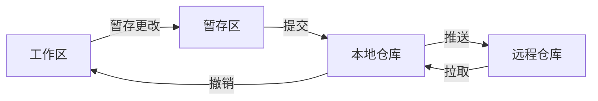

---
tags:
  - tutorial
  - git
  - vscode
  - workflow
---

# VS Code 可视化 Git 工作流

## 学习目标

- 了解 Git 的基本概念（仓库、提交、暂存区、远程）。
- 使用 VS Code 图形界面完成克隆、暂存、提交、推送、拉取。
- 理解暂存区的作用与最佳实践。

## 前置条件

- 已安装 Git 并完成用户配置（参考 [section1/03](../section1/03_git和github安装与登录.md)）。
- 已安装 VS Code。

## Git 核心概念



| 概念         | 说明                         |
| :----------- | :--------------------------- |
| **工作区**   | 你当前正在编辑的文件         |
| **暂存区**   | 准备纳入下一次提交的文件列表 |
| **本地仓库** | 已提交到本地的历史记录       |
| **远程仓库** | GitHub 等远端服务器上的仓库  |

## 步骤

### 第 1 步：打开源代码管理面板

在 VS Code 中，点击左侧活动栏的 **源代码管理** 图标（三个圆点相连的分支形状），或按 `Ctrl+Shift+G`。

该面板会显示当前仓库的所有更改状态。

### 第 2 步：查看更改

当你修改文件后，源代码管理面板会分为两个区域：

- **更改**：已修改但尚未暂存的文件。
- **暂存的更改**：已添加到暂存区、准备提交的文件。

每个文件旁边会显示：

- `M`（Modified）— 文件被修改
- `U`（Untracked）— 新增文件尚未跟踪
- `D`（Deleted）— 文件被删除

> [!tip] 查看差异
>
> 点击更改列表中的文件名，可在右侧编辑器中查看**差异对比**（绿色为新增行，红色为删除行）。确认无误后再进行暂存。

### 第 3 步：暂存更改

暂存（Stage）是将你选中的修改放入"暂存区"，准备提交。

**暂存单个文件**：将鼠标悬停在文件名上，点击右侧的 `+` 图标。

**暂存所有文件**：点击"更改"区域标题栏的 `+` 图标。

> [!note] 为什么要暂存？
>
> 假设你同时修改了 `slide1.md`（修复拼写错误）和 `slide2.md`（添加新内容），这是两个独立的修改。
>
> - **没有暂存区**：你只能一次性提交所有更改，提交信息变成"修复拼写错误并添加新内容"。
> - **有暂存区**：先暂存 `slide1.md`，提交"修复 slide1 拼写错误"；再暂存 `slide2.md`，提交"添加 slide2 新内容"。历史更清晰，也方便后续回溯。

### 第 4 步：提交更改

1. 在源代码管理面板顶部的文本框中，输入**提交信息**（简洁说明本次更改内容）。
2. 点击 **提交** 按钮（或按 `Ctrl+Enter`）。
3. 提交后，更改从暂存区移入本地仓库。

> [!tip] 提交信息规范
>
> 参考 section0 的协作约定，推荐格式：
>
> ```
> docs(section4): 新增 Git 工作流教程
>
> - 可视化暂存、提交、推送流程
> - 补充差异对比说明
> ```

### 第 5 步：推送更改

提交只是将更改保存到了**本地仓库**，还需要推送到**远程仓库**（GitHub）才能与团队同步。

1. 点击源代码管理面板底部的 **同步更改** 按钮。
2. VS Code 会依次执行 `git pull`（拉取远程最新）和 `git push`（推送本地更改）。
3. 如果是首次推送，VS Code 会提示你登录 GitHub 账号进行授权。

> [!warning] 推送被拒绝？
>
> 如果提示"被拒绝"，说明远程有比你更新的提交。此时需要先拉取再推送（见下一步）。

### 第 6 步：拉取更改

在开始工作前或提交后，建议先拉取远程最新更改：

1. 点击源代码管理面板底部的 `…`（更多操作）。
2. 选择 **拉取**（Pull）。
3. 如果远程有更改，它们会被合并到你的本地工作区。

> [!tip] 推荐习惯
>
> - **开始工作前**：先拉取，确保基于最新版本。
> - **提交后**：立即推送，避免本地与远程差距过大。
> - **每天至少一次** `git pull`，保持同步。

### 第 7 步：查看提交历史

1. 在源代码管理面板底部，点击 **图形**（Graph）。
2. 会打开一个可视化提交历史视图，展示所有分支的提交记录。
3. 你可以看到每次提交的作者、时间、信息，以及分支关系。

> 图形视图是理解仓库状态和分支关系的强大工具，善加利用。

## 扩展阅读

- [VS Code 源代码管理官方文档](https://code.visualstudio.com/docs/sourcecontrol/overview)
- [Pro Git 中文版](https://git-scm.com/book/zh/v2)

## 常见问题

**Q：VS Code 提示"没有 Git 源控件"？**
A：检查是否已安装 Git，以及是否在 VS Code 中打开了 Git 仓库（应包含 `.git` 文件夹）。

**Q：提交后想修改提交信息怎么办？**
A：在源代码管理面板的 `…` 菜单中选择 **提交→撤消上次提交**，重新提交。

**Q：如何撤销对某个文件的修改？**
A：在"更改"区域中，右键点击文件 → **放弃更改**，文件将回退到上次提交的状态。

## 练习任务

1. 修改本仓库中的任意一个 `.md` 文件（如修正一处错别字）。
2. 在源代码管理面板中查看更改和差异对比。
3. 暂存修改，输入提交信息，点击提交。
4. 点击同步更改，推送到远程仓库。
5. 在 GitHub 网站确认推送已成功。

## 验收清单

- [ ] 理解工作区、暂存区、本地/远程仓库的关系
- [ ] 能在 VS Code 中查看文件差异对比
- [ ] 能正确使用暂存区进行选择性提交
- [ ] 能完成提交并推送到远程仓库
- [ ] 能拉取远程最新更改
- [ ] 能在图形视图中查看提交历史
