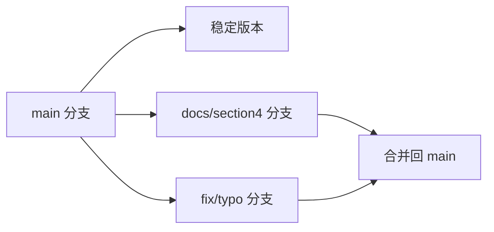
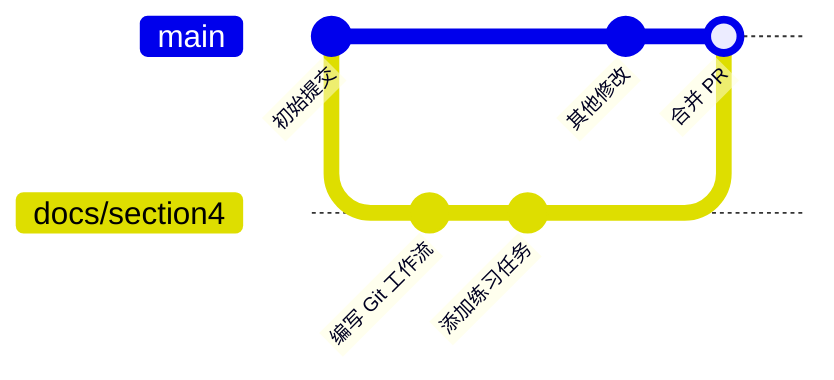

---
tags:
  - tutorial
  - git
  - branch
  - pull-request
  - collaboration
---

# 分支与 PR 协作流程

## 学习目标

- 理解分支的概念与作用。
- 掌握在 VS Code 中创建、切换、合并分支。
- 掌握 Pull Request 的创建与 Code Review 流程。

## 前置条件

- 已掌握基本 Git 工作流（参考 [00_vscode可视化git工作流](00_vscode可视化git工作流.md)）。
- 拥有 GitHub 账号并已登录 VS Code。

## 为什么需要分支？

分支让你可以**并行开发**而不互相干扰：

- `main` 分支始终保持稳定可发布。
- 每个人在自己的分支上工作，完成后再合并。
- 不同功能互不影响，也便于 Code Review。

## 步骤

### 第 1 步：创建新分支

**方法一：通过状态栏**

1. 点击 VS Code 左下角的分支名（默认显示 `main`）。
2. 在弹出的菜单中选择 **创建新分支...**。
3. 输入分支名称（如 `docs/section4-git`），按回车。

**方法二：通过源代码管理**

1. 打开源代码管理面板（`Ctrl+Shift+G`）。
2. 点击底部 `main` → **创建分支...**。
3. 输入分支名称。

> [!tip] 分支命名规范
>
> - `docs/sectionX-描述` — 文档相关
> - `fix/描述` — 修复
> - `feat/描述` — 新功能
>
> 示例：`docs/section4-git-workflow`、`fix/readme-typo`

### 第 2 步：切换分支

**方法一：状态栏切换**

点击左下角分支名，从列表中选择要切换的分支。

**方法二：命令面板**

按 `Ctrl+Shift+P`，输入 `Git: 切换到分支`，选择目标分支。

> [!note] 切换分支时，VS Code 会自动更新文件列表以匹配该分支的内容。请确保当前工作区的更改已提交或暂存，否则可能造成冲突。

### 第 3 步：在分支上工作

切换到新分支后，你的所有修改、暂存、提交都只影响这个分支，不会影响 `main`。

1. 在新分支上修改文件。
2. 暂存并提交更改。
3. 推送到远程（首次推送 VS Code 会提示发布分支）。

### 第 4 步：推送到远程并创建 PR

当你准备将分支合并到 `main` 时，需要创建一个 Pull Request（PR）。

**通过 GitHub 网站：**

1. 推送分支后，GitHub 页面会出现一个 **Compare & pull request** 按钮。
2. 点击按钮，填写 PR 标题和描述。
3. 指定 Reviewers（审核人），点击 **Create pull request**。

**通过 VS Code 扩展（GitHub Pull Requests）：**

1. 安装 GitHub Pull Requests and Issues 扩展。
2. 在 VS Code 中打开 PR 面板，点击 **创建 PR**。
3. 填写信息后提交。

> [!tip] 好的 PR 描述
>
> 一个清晰的 PR 描述应该包含：
>
> - **做了什么**：简要说明更改内容。
> - **为什么**：更改的背景或原因。
> - **测试方式**：如何验证更改正确。
> - **截图**（可选）：UI 变更建议附带截图。

### 第 5 步：Code Review

审核人会在 PR 中：

1. 查看差异对比（Files changed 标签页）。
2. 对具体代码行添加评论。
3. 提出修改建议或直接批准。

作为 PR 作者，你可以在收到 Review 后：

1. 在本地分支上继续修改。
2. 提交并推送，PR 会自动更新。
3. 回复评论说明修改情况。

### 第 6 步：合并分支

Review 通过后，在 GitHub PR 页面点击 **Merge pull request**，有三种合并方式：

| 方式                      | 效果                               | 适用场景                     |
| :------------------------ | :--------------------------------- | :--------------------------- |
| **Create a merge commit** | 保留所有提交历史，生成一个合并提交 | 团队协作，保留详细历史       |
| **Squash and merge**      | 将分支上所有提交压缩为一个提交     | 功能开发，保持历史简洁       |
| **Rebase and merge**      | 将分支提交逐一应用到 main 顶端     | 线性历史，但需处理可能的冲突 |

### 第 7 步：删除远程分支

合并完成后，在 GitHub PR 页面点击 **Delete branch** 删除远程分支。本地分支也可在 VS Code 中删除：

1. 打开源代码管理 → `…` → **分支** → **删除分支**。
2. 选择要删除的本地分支。

### 第 8 步：同步本地 main

合并后，切换回 `main` 分支并拉取最新更改：

1. 点击左下角分支名 → 选择 `main`。
2. 点击源代码管理底部的 **同步更改**（或 `…` → **拉取**）。

至此，一次完整的分支协作流程完成！

## 分支工作流示意

## 扩展阅读

- [GitHub PR 文档](https://docs.github.com/zh/pull-requests)
- [VS Code GitHub PR 扩展](https://code.visualstudio.com/docs/sourcecontrol/github)

## 常见问题

**Q：创建分支后，VS Code 没有自动切换？**
A：创建分支后需要手动切换。创建时如果勾选"从当前分支创建"，默认不会自动切换。

**Q：推送到远程时提示"没有上游分支"？**
A：首次推送本地分支到远程时，VS Code 会询问是否发布。点击 **发布分支** 即可。

**Q：分支太多，如何清理？**
A：合并后及时删除远程和本地分支。在 VS Code 中可通过 `…` → **分支** → **删除分支** 清理本地已合并的分支。

**Q：如果 PR 有冲突怎么办？**
A：GitHub 会提示"合并冲突"。切回本地分支，拉取 `main` 到分支，在本地解决冲突后再推送。具体操作见下一节 [02\_冲突处理演练](02_冲突处理演练.md)。

## 练习任务

1. 从 `main` 创建一个新分支，命名如 `docs/section4-practice`。
2. 在新分支上修改一个文件（如修正一个错别字），提交并推送。
3. 在 GitHub 上创建一个 PR，指向 `main`。
4. （可选）邀请同伴进行 Code Review。
5. 合并 PR，删除远程分支，同步本地 `main`。

## 验收清单

- [ ] 理解分支的作用与命名规范
- [ ] 能在 VS Code 中创建和切换分支
- [ ] 能在新分支上正常提交工作
- [ ] 能创建 PR 并填写清晰的描述
- [ ] 能完成 Code Review 流程（作为作者或审核人）
- [ ] 能合并 PR 并清理分支
