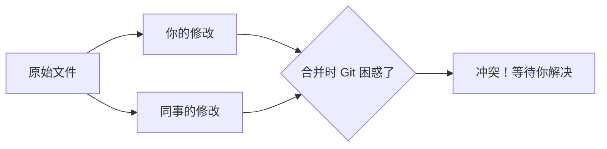

---
tags:
  - tutorial
  - git
  - conflict
  - merge
---

# 冲突处理演练

## 学习目标

- 理解 Git 冲突产生的原因。
- 掌握 VS Code 冲突标记的识别方法。
- 掌握使用 VS Code 合并编辑器解决冲突。
- 学会如何预防和减少冲突。

## 前置条件

- 已掌握分支与 PR 基本操作（参考 [01\_分支与PR协作流程](01_分支与PR协作流程.md)）。
- 准备好一个可自由操作的实验仓库（建议使用本仓库的副本或测试仓库）。

## 冲突是怎么产生的？

当两个人修改了**同一个文件的同一区域**时，Git 无法自动判断保留谁的更改，就会产生冲突。



> 如果修改的是**不同文件**或同一文件的**不同区域**，Git 可以自动完成合并，不会产生冲突。

---

## 演练场景设置

为了让演练更真实，我们模拟以下场景：

1. 你和同事同时从 `main` 分支的最新版本开始工作。
2. 你们都修改了同一个文件 `README.md` 的"项目简介"段落。
3. 你先提交并推送了你的修改。
4. 同事在拉取你的修改时遇到了冲突。

> 你可以找一位同伴配合，也可在本地通过两个分支自行模拟。

### 自行模拟冲突（单人）

如果你没有同伴配合，可以按以下步骤在本地模拟：

```bash
# 1. 在 main 分支上创建一个基础文件
echo "原始内容" > conflict-demo.md
git add conflict-demo.md
git commit -m "添加演示文件"

# 2. 创建分支 A 并修改
git checkout -b branch-a
echo "分支A的修改" > conflict-demo.md
git add conflict-demo.md
git commit -m "分支A的修改"

# 3. 切回 main，创建分支 B 并修改
git checkout main
git checkout -b branch-b
echo "分支B的修改" > conflict-demo.md
git add conflict-demo.md
git commit -m "分支B的修改"
```

现在尝试合并 `branch-a` 到 `branch-b`：

```bash
git merge branch-a
```

系统会提示冲突。

---

## 步骤

### 第 1 步：识别冲突

当冲突发生时，VS Code 会在多个地方给出提示：

1. **源代码管理面板**：冲突的文件会显示带有 `!` 标记。
2. **编辑器内**：打开冲突文件，会看到清晰的冲突标记。
3. **状态栏**：左下角会显示当前分支有未解决的冲突。

一个被标记了冲突的文件看起来是这样的：

```markdown
# 我的文档

<<<<<<< HEAD
这是我当前分支的修改内容。
=======
这是来自其他分支的修改内容。

> > > > > > > branch-a

文档的其他内容...
```

| 标记               | 含义                                     |
| :----------------- | :--------------------------------------- |
| `<<<<<<< HEAD`     | 冲突开始，`HEAD` 之后是你当前分支的更改  |
| `=======`          | 分隔线，上方是你的更改，下方是传入的更改 |
| `>>>>>>> branch-a` | 冲突结束，标记传入更改的来源分支         |

### 第 2 步：选择冲突解决方案

VS Code 在冲突区域上方提供了操作按钮：

| 按钮                       | 效果                           |
| :------------------------- | :----------------------------- |
| **Accept Current Change**  | 只保留你当前分支的更改         |
| **Accept Incoming Change** | 只保留传入分支的更改           |
| **Accept Both Changes**    | 同时保留双方更改（按顺序拼接） |
| **Compare Changes**        | 在合并编辑器中详细对比         |

> 你也可以手动编辑冲突区域，自由组合两边的更改，然后删除所有 `<<<<<<<`、`=======`、`>>>>>>>` 标记。

### 第 3 步：使用合并编辑器（推荐）

VS Code 提供了强大的**合并编辑器**来处理复杂冲突：

1. 在冲突文件上点击 **在合并编辑器中解决**。
2. 合并编辑器分为三栏：
   - **左侧**：传入的更改（来自其他分支）。
   - **中间**：合并结果（你的输出区域）。
   - **右侧**：你当前的更改（当前分支）。
3. 你可以选择性地从左侧或右侧接受更改到中间区域。
4. 编辑完成后，点击 **完成合并**。

> 合并编辑器让你能精确控制最终结果，尤其适合复杂的冲突场景。

### 第 4 步：标记冲突已解决

当你完成以下操作后，冲突即被视为已解决：

1. 删除了所有 `<<<<<<<`、`=======`、`>>>>>>>` 标记。
2. 文件内容已修改为你期望的最终版本。
3. 保存文件。

在源代码管理面板中：

1. 暂存已解决的冲突文件（点击 `+` 图标）。
2. 输入提交信息（如 "解决 README.md 合并冲突"）。
3. 点击 **提交**。

> [!tip] 提交信息说明
>
> 合并冲突的提交会自动生成一条合并提交信息，你可以在其中补充说明冲突的解决方式。

### 第 5 步：推送结果

提交后，推送到远程仓库：

1. 点击 **同步更改**。
2. 确认远程已更新。

---

## 冲突预防策略

避免冲突比解决冲突更高效：

> [!note] 最佳实践
>
> - **频繁拉取**：开始工作前和提交后都执行 `git pull`，保持本地最新。
> - **小步提交**：频繁提交小更改，减少每次更改的覆盖范围。
> - **沟通**：和队友沟通谁在修改哪些文件。
> - **模块化**：尽量将不同内容拆分为不同文件，减少多人同时编辑同一文件的机会。

---

## 扩展阅读

- [Git 分支合并 (Pro Git)](https://git-scm.com/book/zh/v2/Git-%E5%88%86%E6%94%AF-%E5%88%86%E6%94%AF%E7%9A%84%E6%96%B0%E5%BB%BA%E4%B8%8E%E5%90%88%E5%B9%B6)
- [VS Code 合并编辑器文档](https://code.visualstudio.com/docs/sourcecontrol/overview#_merge-conflicts)

## 常见问题

**Q：我不小心接受了错误的更改，可以撤销吗？**
A：如果尚未提交，可以使用 `…` → **中止合并** 回到合并前的状态。如果已提交，可以使用 `…` → **撤消上次提交**。

**Q：冲突标记太多，手动删除很麻烦？**
A：使用 VS Code 的合并编辑器可以避免手动删除标记。也可使用"接受当前更改"或"接受传入更改"按钮一键解决。

**Q：如何知道哪些文件有冲突？**
A：在源代码管理面板中，冲突的文件前面会显示 `!` 标记，VS Code 也会在状态栏提示冲突数量。

**Q：合并提交信息很重要吗？**
A：是的。包含冲突解决说明的提交信息可以帮助团队成员理解为什么某些更改被保留或放弃。

## 练习任务

### 单人模式

1. 在本地创建一个测试文件 `test-conflict.md`。
2. 按照"自行模拟冲突"的步骤，创建两个分支并修改同一文件。
3. 尝试合并，观察冲突标记。
4. 分别测试"接受当前更改"、"接受传入更改"、"接受双方更改"三种方式。
5. 再试一次，使用合并编辑器解决冲突。

### 双人模式（推荐）

1. 和同伴各自克隆同一个仓库。
2. 各自创建一个分支（如 `docs/你的名字`）。
3. 同时修改 `README.md` 的同一段落。
4. 依次提交并推送到远程。
5. 第二个人拉取时解决冲突。

## 验收清单

- [ ] 理解冲突产生的原因（同一文件同一区域）
- [ ] 能识别冲突标记 `<<<<<<<`、`=======`、`>>>>>>>`
- [ ] 能使用 VS Code 的按钮快速解决冲突
- [ ] 能使用合并编辑器精确处理复杂冲突
- [ ] 能正确提交合并结果并推送
- [ ] 了解冲突预防策略（频繁拉取、小步提交、沟通）
